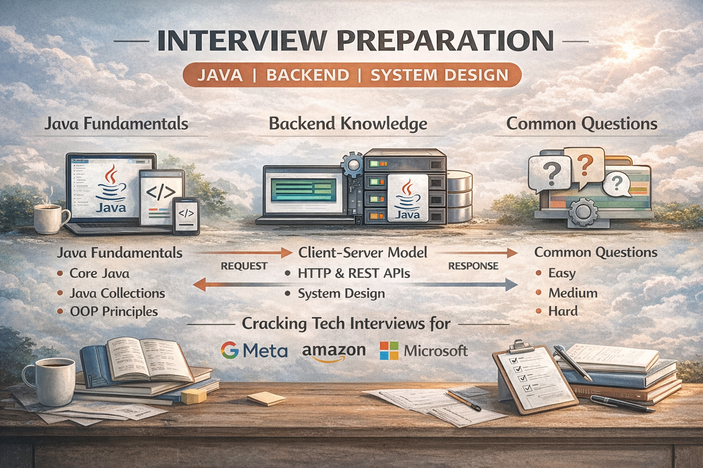

  

    
    
    
    
  

  <h3 align="center">Java Interview Preparation Notes</h3>

  

    Clear concepts, structured revision, and interview-ready Java understanding.
  
 
    

   

---

## 📋 Table of Contents

1. 📘 [Introduction](#introduction)
2. 🎯 [Goals & Outcomes](#goals--outcomes)
3. 🗂️ [Repository Structure](#repository-structure)
4. 🧭 [Engineering Journey Fit](#engineering-journey-fit)
5. ⭐ [What Makes This Different](#what-makes-this-different)
6. 🛠️ [How to Use This Repository](#how-to-use-this-repository)
7. 🔁 [Learning Philosophy](#learning-philosophy)
8. 💼 [Interview Relevance](#interview-relevance)
9. 🛣️ [Future Roadmap](#future-roadmap)
10. 🤝 [Contributions](#contributions)
11. 🚀 [Closing Note](#closing-note)

---

## 📘 Introduction

Interview preparation often fails because learning is **unstructured and rushed**.

**`java-interview-prep-notes`** exists to provide **clear, organized, and concept-focused Java interview notes**, built through consistent learning and real problem-solving.

This repository is for:

- Computer engineering students
- Java and backend-focused developers
- Candidates preparing for technical interviews

---

## 🎯 Goals & Outcomes

- Master Java fundamentals and core concepts
- Understand interview questions, not memorize answers
- Build structured revision material
- Improve technical explanation skills
- Prepare confidently for Java interviews

---

## 🗂️ Repository Structure

java-interview-prep-notes/ 
├── 01-java-fundamentals/ 
├── 02-oops-concepts/ 
├── 03-collections-framework/ 
├── 04-exception-handling/ 
├── 05-multithreading/ 
├── 06-dsa-interview-notes/ 
├── 07-system-design-basics/ 
├── 08-interview-experiences/ 
└── README.md 
Organized for fast revision and deep understanding.

## 🧭 Engineering Journey Fit

This repository is part of a disciplined roadmap including:

100 days of Java fundamentals

Daily Java DSA practice

Java mini projects

Backend and full-stack learning

System design fundamentals

It serves as the central interview preparation layer.

## ⭐ What Makes This Different

Concept-driven explanations, not shortcuts

Written in interview-expected language

Clean structure without clutter

Built gradually through daily learning

Designed as a long-term reference

## 🛠️ How to Use This Repository

Start with Java fundamentals

Read actively and take notes

Explain concepts in your own words

Connect notes with coding practice

Use for regular interview revision

## 🔁 Learning Philosophy

Strong interviews come from strong fundamentals.

Consistency matters more than speed.

## 💼 Interview Relevance

Covers core Java interview topics

Strengthens backend technical rounds

Improves clarity in explanations

Supports real interview discussions

## 🛣️ Future Roadmap

Advanced JVM concepts

Java performance basics

Backend-specific interview questions

Design pattern explanations

Quick revision checklists

## 🤝 Contributions

Feedback and improvements are welcome.
Fork, revise, and grow with consistency.

## 🚀 Closing Note

Interviews test thinking, clarity, and fundamentals.

This repository is built to strengthen all three —
calmly, consistently, and correctly.

Built to understand. Built to revise. Built to succeed.
