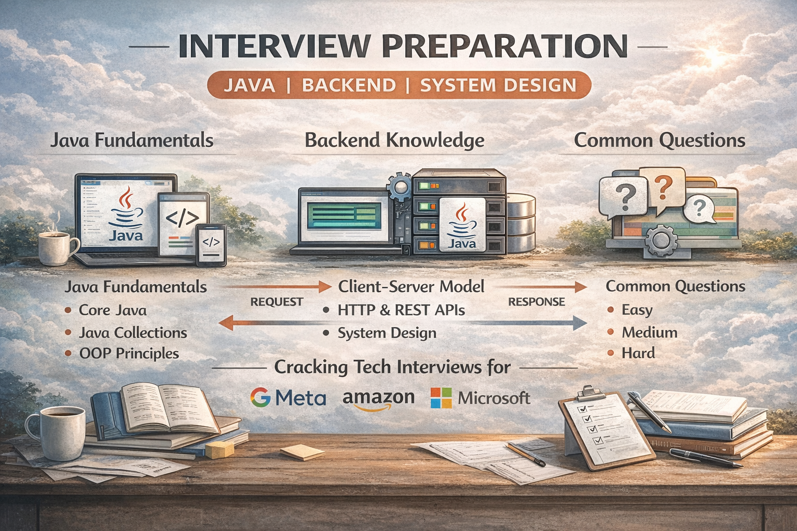

<div align="center">

<div>


</div>

<br>



<br>

<h2 align="center">Java Backend Interview Preparation</h2>

<p align="center">
A structured 30-day Java learning journey designed to build strong fundamentals, backend understanding, and interview-ready thinking.
</p>

</div>

---

# 📋 Table of Contents

1. 📘 [Introduction](#-introduction)
2. 🎯 [Goals & Outcomes](#-goals--outcomes)
3. ⚡ [Recruiter Quick Scan](#-recruiter-quick-scan)
4. 🗂️ [Repository Structure](#️-repository-structure)
5. 🧭 [Engineering Journey Fit](#-engineering-journey-fit)
6. 📚 [30-Day Java Learning Roadmap](#-30-day-java-learning-roadmap)
7. ⭐ [What Makes This Repository Different](#-what-makes-this-repository-different)
8. 🛠️ [How to Use This Repository](#️-how-to-use-this-repository)
9. 🔁 [Learning Philosophy](#-learning-philosophy)
10. 💼 [Interview Relevance](#-interview-relevance)
11. ⚡ [Quick Revision Map](#-quick-revision-map)
12. 🏆 [Learning Outcomes](#-learning-outcomes)
13. 🛣️ [Future Roadmap](#️-future-roadmap)
14. 📊 [Repository Stats](#-repository-stats)
15. 👨‍💻 [Author](#-author)
16. 📜 [License](#-license)
17. 🤝 [Contributions](#-contributions)
18. 🚀 [Closing Note](#-closing-note)

---

# 📘 Introduction

Many developers struggle in interviews not because they cannot code —  
but because they **lack deep understanding of Java fundamentals**.

Most interview preparation resources are:

• unstructured  
• rushed  
• focused on memorization  

**`java-interview-prep-notes`** was created to solve that problem.

This repository is a **structured knowledge base for Java interviews**, covering:

• Core Java fundamentals  
• Object-Oriented Programming  
• Collections Framework  
• Exception Handling  
• Multithreading  
• JVM basics  
• Backend fundamentals  

Instead of random notes, this repository focuses on:

✔ concept clarity  
✔ interview-oriented explanations  
✔ structured revision  

This project is designed for:

• Computer Engineering students  
• Java backend learners  
• Developers preparing for technical interviews  

---

# 🎯 Goals & Outcomes

The goal of this repository is to build **strong Java fundamentals required for backend engineering and technical interviews.**

Key outcomes of this learning journey:

✔ Understand Java concepts deeply  
✔ Learn how collections work internally  
✔ Build strong OOP foundations  
✔ Understand multithreading fundamentals  
✔ Connect Java with backend architecture  
✔ Improve technical explanation skills  

By the end of this journey, the transition becomes:

```
Writing Java Programs
        ↓
Understanding Java Internals
        ↓
Thinking Like a Backend Engineer
```

---

# ⚡ Recruiter Quick Scan

✔ 30-day structured Java learning journey  
✔ Covers most common **Java backend interview topics**  
✔ Includes **Collections, JVM, Multithreading**  
✔ Interview-focused explanations  
✔ Clean structured repository  
✔ Concept-driven learning  

---

# 🗂️ Repository Structure

```
java-interview-prep-notes
│
├── Day-01
├── Day-02
├── Day-03
├── Day-04
├── Day-05
├── Day-06
├── Day-07
├── Day-08
├── Day-09
├── Day-10
│
├── Day-11
├── Day-12
├── Day-13
├── Day-14
│
├── Day-15
├── Day-16
├── Day-17
├── Day-18
├── Day-19
│
├── Day-20
├── Day-21
├── Day-22
├── Day-23
├── Day-24
│
├── Day-25
├── Day-26
├── Day-27
├── Day-28
├── Day-29
├── Day-30
```

Each day includes:

• README explanation  
• structured notes  
• cheat sheets  
• interview insights  

---

# 📚 30-Day Java Learning Roadmap

### Phase 1 — Java Fundamentals

Day 01 → [Java Basics](./Day-01/README.md)  
Day 02 → [Data Types & Variables](./Day-02/README.md)  
Day 03 → [Control Flow](./Day-03/README.md)  
Day 04 → [Methods & Functions](./Day-04/README.md)  
Day 05 → [Classes & Objects](./Day-05/README.md)  

---

### Phase 2 — OOP Concepts

Day 06 → [Encapsulation](./Day-06/README.md)  
Day 07 → [Inheritance](./Day-07/README.md)  
Day 08 → [Polymorphism](./Day-08/README.md)  
Day 09 → [Abstraction](./Day-09/README.md)  
Day 10 → [OOP Interview Questions](./Day-10/README.md)  

---

### Phase 3 — Collections Framework

Day 11 → [Collections Introduction](./Day-11/README.md)  
Day 12 → [ArrayList & LinkedList](./Day-12/README.md)  
Day 13 → [Stack & Queue](./Day-13/README.md)  
Day 14 → [Core Java Cheat Sheet](./Day-14/README.md)  
Day 15 → [Collections Overview](./Day-15/README.md)  
Day 16 → [List & Set Interfaces](./Day-16/README.md)  
Day 17 → [Map Interface & Hashing](./Day-17/README.md)  
Day 18 → [Comparable vs Comparator](./Day-18/README.md)  
Day 19 → [Collections Cheat Sheet](./Day-19/README.md)  

---

### Phase 4 — Advanced Java Concepts

Day 20 → [Exception Handling](./Day-20/README.md)  
Day 21 → [Checked vs Unchecked Exceptions](./Day-21/README.md)  
Day 22 → [Multithreading Basics](./Day-22/README.md)  
Day 23 → [Synchronization & Concurrency](./Day-23/README.md)  
Day 24 → [JVM Memory & Garbage Collection](./Day-24/README.md)  

---

### Phase 5 — Backend Concepts

Day 25 → [Spring Boot Architecture](./Day-25/README.md)  
Day 26 → [REST Controllers](./Day-26/README.md)  
Day 27 → [Spring Boot Exception Handling](./Day-27/README.md)  
Day 28 → [Spring Boot API Flow](./Day-28/README.md)  
Day 29 → [Top 50 Java Backend Interview Questions](./Day-29/README.md)  
Day 30 → [Final Revision Cheat Sheet](./Day-30/README.md)  

---

# 🧭 Engineering Journey Fit

This repository connects multiple parts of backend learning:

```
Java Fundamentals
        ↓
Java Interview Preparation  ← (this repository)
        ↓
Java System Design
        ↓
Backend Development
```

It acts as the **bridge between coding practice and backend architecture thinking.**

---

# ⭐ What Makes This Repository Different

✔ Concept-driven explanations  
✔ Structured daily learning  
✔ Interview-focused content  
✔ Backend-oriented mindset  
✔ Clean GitHub documentation  

This repository is not just notes.

It is a **structured Java learning journey.**

---

# 🛠️ How to Use This Repository

Best approach:

1️⃣ Follow the days sequentially  
2️⃣ Read the README explanations  
3️⃣ Revise using notes and cheat sheets  
4️⃣ Connect concepts with coding practice  
5️⃣ Practice explaining concepts clearly  

Best use cases:

• Java interview preparation  
• backend fundamentals revision  
• quick concept refresh  

---

# 🔁 Learning Philosophy

Strong engineers focus on **fundamentals first.**

Instead of memorizing answers:

Understand  

• why a concept exists  
• where it is used  
• how it behaves internally  

Learning model used here:

```
Clarity
  ↓
Consistency
  ↓
Confidence
```

---

# 💼 Interview Relevance

This repository prepares you for common interview topics:

• Core Java fundamentals  
• OOP principles  
• Collections framework  
• HashMap internals  
• Exception handling  
• Multithreading basics  
• JVM memory model  
• Spring Boot architecture  

These topics appear frequently in:

• Java backend interviews  
• entry-level developer interviews  
• backend internship interviews  

---

# ⚡ Quick Revision Map

If you have **30 minutes before an interview**, revise:

Day 15 → [Collections Overview](./Day-15/README.md)  <br>
Day 17 → [Map Interface & Hashing](./Day-17/README.md)   <br> 
Day 18 → [Comparable vs Comparator](./Day-18/README.md)   <br>
Day 22 → [Multithreading Basics](./Day-22/README.md)  <br>
Day 24 → [JVM Memory & Garbage Collection](./Day-24/README.md)  <br>
Day 29 → [Top 50 Java Backend Interview Questions](./Day-29/README.md) <br>  

---

# 🏆 Learning Outcomes

After completing this repository you will be able to:

✔ Explain Java concepts clearly  
✔ Understand collections internals  
✔ Discuss multithreading basics  
✔ Explain JVM memory model  
✔ Think like a backend engineer  

---

# 🛣️ Future Roadmap

Possible future expansions:

• Java design patterns  
• advanced concurrency  
• Spring Boot production architecture  
• microservices basics  
• backend system design  

---

# 📊 Repository Stats


---

# 👨‍💻 Author

**Krushna Nawale**

Computer Engineering Student  
Java Backend Learner  

GitHub  
https://github.com/Krushna4142  

LinkedIn  
https://www.linkedin.com/in/krushna4142/  

---

# 📜 License

This project is licensed under the **MIT License**.

You are free to:

✔ Use  
✔ Modify  
✔ Share  
✔ Learn from it  

---

# 🤝 Contributions

Suggestions, discussions, and improvements are welcome.

If you are learning Java as well, feel free to **fork this repository and build your own structured learning journey.**

---

# 🚀 Closing Note

Technical interviews test three things:

• fundamentals  
• clarity  
• reasoning  

This repository was built to strengthen all three.

<div align="center">

⭐ If this repository helped you, consider giving it a star.

Built for learning.  
Built for clarity.  
Built for real interviews.

</div>
